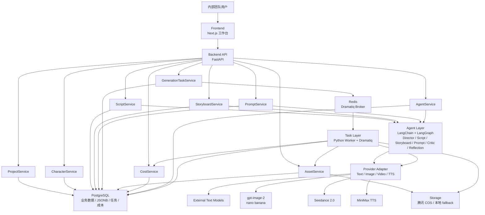

# AI 英歌漫剧内容生产工作台技术架构设计 v1

本文基于以下文档：

- `/Users/huabi/code/AI-video-studio/CODEX_RULES.md`
- `/Users/huabi/code/AI-video-studio/docs/06-prd/PRD-v1.0.md`
- `/Users/huabi/code/AI-video-studio/docs/07-excel-analysis/yingge-character-bible-analysis.md`
- `/Users/huabi/code/AI-video-studio/docs/01-source-analysis/reference-projects-for-prd-v1.md`

当前阶段仍是 PRD v1.0 与 MVP 架构设计阶段。本文不写业务代码，只给出一个月内可落地的技术架构取舍。

本版重新评估后的重要修正：

- 后端必须使用 Python。
- Agent 工程能力是项目目标之一，LangChain/LangGraph 需要进入架构，而不是完全自研替代。
- 用户代码能力可信，架构可以比“最简全栈 TS”更工程化，但 MVP 仍要克制。

## 1. 技术栈选择

### 1.1 核心约束

| 约束 | 对技术选型的影响 |
|---|---|
| 一个月内必须做出 MVP | 架构要能快速跑通闭环，避免微服务化和过度平台化 |
| 预算 4000 元 | 模型调用、对象存储、云数据库、队列资源都要可控 |
| 用户明确要求 Python 后端 | 后端以 FastAPI、SQLAlchemy、LangChain、Python Worker 为核心 |
| 用户希望沉淀 Agent 工程能力 | LangChain/LangGraph 应作为 Agent 编排底座，但业务边界要自研清晰 |
| 当前团队自用 | 不做多租户、企业级权限、复杂部署 |
| 后续要沉淀 IP 资产 | 角色、Prompt、任务、素材、成本必须结构化 |
| 生图/生视频/TTS 都是异步任务 | 必须有任务状态、失败重试、成本记录和外部任务轮询 |

重新评估结论：

原先“统一 TypeScript 降低维护成本”的判断过于保守。这个项目的长期价值之一是 AI Agent 工程能力沉淀，而 Python 在 LangChain、LangGraph、多模型适配、Excel 解析、异步任务和 AI 工具链上更符合这个方向。技术栈可以接受前端 TypeScript + 后端 Python 的双语言结构，只要接口边界清楚、数据模型稳定、目录结构克制。

### 1.2 后端：FastAPI 还是 Node/TS

推荐：`FastAPI + Python`。

原因：

- 用户明确要求后端必须使用 Python，这是首要约束。
- LangChain、LangGraph、LangSmith、Pydantic、SQLAlchemy、Dramatiq/Celery 都在 Python 生态中更自然。
- Excel 角色 IP 圣经的多级表头、合并单元格、字段解析，用 Python 的 `openpyxl` / `pandas` 更顺手。
- 模型调用、Agent 输入输出、结构化解析、失败复盘都更适合用 Pydantic schema 做强约束。
- 未来若要沉淀 Agent 工程能力，Python 后端更贴近主流 AI Agent 工程实践。

不推荐 Node/TS 作为后端主栈：

- Node/TS 可以做工作台后端，但会削弱 LangChain Python 生态的直接收益。
- 若后续要使用 LangGraph、Agent 状态图、评估链路、Prompt 测试，Python 更省力。
- 本项目不是纯 CRUD SaaS，AI 工作流是核心后端能力。

建议形态：

- 前端：Next.js 工作台。
- 后端：FastAPI 独立 API 服务。
- Worker：Python Worker 处理生图、生视频、TTS、外部任务轮询。
- Agent：LangChain/LangGraph + 自研业务封装。

### 1.3 数据库：PostgreSQL 还是 SQLite

推荐：`PostgreSQL`。

原因：

- 角色 IP 圣经有大量半结构化字段，PostgreSQL 的 `jsonb` 适合保存 `life_event_nodes`、`relationship_graph`、`source_fields`、`request_payload`、`response_payload`。
- 任务、素材、成本记录会持续增长，PostgreSQL 的并发写入、索引和迁移更稳。
- 未来可能扩展 ToB、多人协作、素材中心，PostgreSQL 不会成为瓶颈。
- SQLAlchemy 2.0 + Alembic 对 PostgreSQL 支持成熟，也方便 AI 生成迁移和模型代码。

不推荐 SQLite 作为正式 MVP 数据库：

- SQLite 很适合本地原型，但异步任务、素材状态、成本记录、多人协作会更快碰到并发和部署边界。
- 角色 Excel 导入后会形成长期 IP 资产，后续迁移不值得省。

允许折中：

- 本地开发可用 Docker PostgreSQL。
- 极端情况下可用 SQLite 做当天验证，但正式 MVP 以 PostgreSQL 为准。

### 1.4 ORM 与迁移

推荐：`SQLAlchemy 2.0 + Alembic + Pydantic v2`。

原因：

- SQLAlchemy 适合 Python 后端长期维护。
- Alembic 是 Python 生态标准迁移工具。
- Pydantic v2 可作为 API schema、Agent 输入输出 schema、Provider Adapter schema 的统一校验层。
- 比 Django ORM 更轻，和 FastAPI 契合更好。

不推荐 Prisma：

- Prisma 更适合 TypeScript 后端。
- 既然后端确定 Python，继续使用 Prisma 会增加跨语言数据访问复杂度。

### 1.5 任务队列：Celery / Dramatiq / BullMQ / 简化异步任务

推荐：`Dramatiq + Redis`。

原因：

- Python 生态中 Celery 最成熟，但配置和运行心智偏重。
- Dramatiq 比 Celery 更轻，足够支撑 MVP 的生图、生视频、TTS、轮询任务。
- BullMQ 属于 Node 生态，不适合作为 Python 后端首选。
- 只用 FastAPI BackgroundTasks 或纯数据库轮询过于脆弱，生视频任务耗时长，任务恢复、重试、并发控制都会很快变成坑。

MVP 任务设计：

- `GenerateTask` 表是事实源，记录业务状态。
- Dramatiq 负责执行后台任务。
- Redis 只做队列中间件，不作为业务数据源。
- Worker 执行时必须先锁定任务状态，避免重复扣费。
- 外部模型返回任务 ID 后，轮询任务可以单独排队。

为什么不选 Celery：

- Celery 适合更复杂的生产环境，但一个月 MVP 不需要完整 canvas、复杂 routing、beat 管理体系。
- Dramatiq 的概念更少，更适合当前项目速度。

扩展口：

- `TaskRunner` 抽象必须独立，后续可以从 Dramatiq 替换为 Celery。
- `GenerateTask.status` 必须兼容 `queued`、`processing`、`completed`、`failed`、`canceled`。

### 1.6 对象存储：腾讯 COS

推荐：`腾讯 COS`，本地开发保留 `local storage` fallback。

原因：

- 目标用户在中国环境，腾讯 COS 接入、访问和成本更友好。
- 图片、视频、音频素材会快速变大，不适合长期放数据库或 Git 仓库。
- 成片方案需要保存可回溯 URL、文件大小、模型来源和授权信息。

MVP 规则：

- 本地开发可先保存到 `storage/local`。
- 线上保存到 COS。
- `Asset` 表统一记录 `storage_provider`、`object_key`、`public_url`、`mime_type`、`size_bytes`。
- SecretId、SecretKey 不进前端，不进日志，不写入导出方案。

### 1.7 前端：Next.js 还是 Nuxt

推荐：`Next.js + React + TypeScript`。

原因：

- 工作台页面需要复杂表格、Prompt 编辑、分镜卡片、素材墙、任务状态面板，React/Next 生态成熟。
- shadcn/ui、TanStack Table、表单组件生态适合快速构建内部工具。
- 前端和后端通过 OpenAPI schema 对齐即可，不要求同语言。
- 参考项目中的工作台和资产中心经验多偏 React/TS。

不推荐 Nuxt：

- Nuxt/Vue 同样可行，但当前项目更适合利用 Next.js 的工作台生态。
- 后端已经是 Python，前端不需要再引入新的 Vue 生态学习成本。

### 1.8 Agent 编排：自研轻量框架还是 LangChain/LlamaIndex

推荐：`LangChain + LangGraph + 自研业务约束`。

定位：

- LangChain：负责模型调用抽象、Prompt Template、结构化输出、Runnable 链。
- LangGraph：负责 6 个 Agent 的状态图、节点流转、可中断人工确认。
- 自研业务约束：负责角色字段读取、Prompt 版本、成本记录、任务提交、素材采纳、失败复盘。

为什么需要 LangChain/LangGraph：

- 项目目标包含技术学习和 Agent 工程能力沉淀，不能只做普通 CRUD + Prompt 字符串拼接。
- 6 个 Agent 虽然第一版要轻量，但天然有状态流：Director -> Script -> Storyboard -> Prompt -> Critic -> 人工确认 -> Generation -> Reflection。
- LangGraph 能表达“人工确认”“失败回路”“复盘写入记忆”这些流程，避免后期补状态机时推翻架构。
- LangChain 的结构化输出和工具封装可以让 Agent 输入输出更可控。

边界：

- 不做复杂全自动自主 Agent。
- 不让 Agent 直接触发高成本生图/生视频。
- 不把业务数据藏在 LangChain memory 里，业务事实仍写 PostgreSQL。
- LangChain 只做编排与模型调用，不替代 ProjectService、CharacterService、TaskService。

不推荐 LlamaIndex 作为 MVP 主框架：

- 当前 MVP 的核心不是文档 RAG，而是角色结构化字段、脚本分镜和生成任务。
- 后续做英歌知识库检索时，可以补充 LlamaIndex 或向量库；MVP 先不用。

### 1.9 模型适配：统一 Provider Adapter

推荐：自研 `Provider Adapter`，底层可复用 LangChain 的模型接口，但图片、视频、TTS 必须单独封装。

能力分类：

| 能力 | 目标模型/服务 | Adapter 输出 |
|---|---|---|
| 文本 | 多模型配置 | 文案、分镜、Prompt、检查意见、复盘建议 |
| 图片 | `gpt-image-2`、`nano banana` | 图片生成任务、图片 URL 或文件 |
| 视频 | `Seedance 2.0` | 视频生成任务、视频 URL 或文件 |
| TTS | `MiniMax TTS` | 音频生成任务、音频 URL 或文件 |

Adapter 必须统一：

- `provider`
- `model`
- `capability`
- `request_payload`
- `external_task_id`
- `status`
- `result_urls`
- `usage`
- `estimated_cost`
- `raw_response_sanitized`

参考：

- Toonflow vendor 思路：`/Users/huabi/code/AI-video-studio/references/Toonflow-app/data/vendor/grsai.ts`、`/Users/huabi/code/AI-video-studio/references/Toonflow-app/data/vendor/volcengine.ts`
- waoowaoo 模型网关和能力目录：`/Users/huabi/code/AI-video-studio/references/waoowaoo/src/lib/generator-api.ts`、`/Users/huabi/code/AI-video-studio/references/waoowaoo/src/lib/model-config-contract.ts`

安全限制：

- 不采用 Toonflow 的动态 vendor 执行方案，不在 MVP 中运行用户可编辑代码。
- API Key 只从服务端环境变量或安全配置读取。

## 2. 推荐 MVP 技术栈

最终推荐：

| 层级 | 推荐技术 | 选择原因 |
|---|---|---|
| 前端 | Next.js + React + TypeScript | 适合工作台 UI，生态成熟，和 Python API 可通过 OpenAPI 对齐 |
| UI | Tailwind CSS + shadcn/ui 风格组件 | 快速搭建表格、表单、弹窗、Tabs、素材墙 |
| 后端 | FastAPI + Python | 符合用户要求，适合 AI Agent、任务、模型适配、Excel 解析 |
| API Schema | Pydantic v2 | 统一 API、Agent 输入输出、Provider Adapter 数据校验 |
| ORM | SQLAlchemy 2.0 | Python 后端主流 ORM，适合 PostgreSQL |
| 迁移 | Alembic | 标准数据库迁移工具 |
| 数据库 | PostgreSQL | JSONB、任务并发、未来扩展更稳 |
| 任务队列 | Dramatiq + Redis | 比 Celery 轻，比纯后台任务可靠 |
| 文件存储 | 腾讯 COS + 本地 fallback | 线上存素材，本地开发简单 |
| Excel 解析 | openpyxl，必要时 pandas 辅助 | 支持多级表头、合并单元格、只读导入 |
| Agent 编排 | LangChain + LangGraph | 沉淀 Agent 工程能力，支持状态流和结构化输出 |
| 模型适配 | 自研 Provider Adapter + LangChain 文本模型封装 | 统一文本、生图、生视频、TTS 接口 |
| 成本记录 | 自研 CostService + 配置化模型价格 | 满足 4000 元预算可见 |
| 部署 | 前端、API、Worker、Redis、PostgreSQL 分进程部署 | 不做微服务，但进程边界清晰 |

一句话：用 `Next.js 前端 + FastAPI Python 后端 + PostgreSQL + SQLAlchemy/Alembic + Dramatiq/Redis + LangChain/LangGraph + COS + Provider Adapter`，跑通英歌人物短视频生产闭环，同时沉淀可继续升级的 Agent 工程能力。

## 3. 系统架构图



## 4. 核心服务设计

### 4.1 ProjectService

职责：

- 创建、更新、归档项目。
- 管理项目状态：draft、script_ready、storyboard_ready、prompt_ready、generating、asset_review、exported。
- 汇总项目角色、脚本、分镜、素材、成本。

输入：

- 项目名称、目标平台、目标时长、项目类型、关联角色。

输出：

- `Project`
- 项目成本概览
- 项目当前阶段

关键规则：

- MVP 默认项目类型为“英歌水浒人物介绍”。
- 一个项目至少绑定一个 `ProjectCharacter`。
- 高成本任务必须由用户确认后触发。

### 4.2 CharacterService

职责：

- 导入 Excel 角色 IP 圣经。
- 管理 `Character`、`ProjectCharacter`、`CharacterVisualProfile`、`CharacterNarrativeProfile`、`CharacterCommercialProfile`、`PromptKeywordSet`。
- 生成角色一致性摘要。

输入：

- Excel 文件、角色搜索条件、人工编辑字段。

输出：

- 角色列表
- 角色详情
- 项目角色快照
- 角色一致性摘要

关键规则：

- Excel 导入必须识别三行多级表头、合并单元格和第 4 行起的数据。
- `基本信息` 必须拆成 `name`、`nickname`、`ranking`、`star_position`、`origin`。
- `正向词` 和 `禁止词` 必须分开存储。
- 不覆盖人工修改，导入时保留 `source_hash`、`manual_override`、来源行号。

来源依据：

- `/Users/huabi/code/AI-video-studio/docs/07-excel-analysis/yingge-character-bible-analysis.md`

### 4.3 ScriptService

职责：

- 基于角色生成 30-60 秒人物介绍文案。
- 支持用户粘贴/导入已有文案。
- 保存文案版本。

输入：

- `ProjectCharacter`
- `CharacterNarrativeProfile`
- 目标平台、时长、风格
- 用户已有文案

输出：

- `Script`
- 文案版本记录

关键规则：

- 文案必须围绕单个水浒人物。
- 不虚构未确认的英歌文化事实。
- 生成结果必须可人工编辑。
- ScriptAgent 通过 `AgentService` 调用 LangChain/LangGraph，不在 Service 内直接拼接模型请求。

### 4.4 StoryboardService

职责：

- 将脚本拆成 5-8 个分镜。
- 管理 `ScriptScene` 和 `Shot`。
- 绑定角色与场景档案。

输入：

- `Script`
- `ProjectCharacter`
- `ProjectScene`
- 角色一致性摘要

输出：

- `ScriptScene`
- `Shot`
- 分镜表

关键规则：

- 30-60 秒视频默认 5-8 个镜头。
- 每个镜头必须有画面描述、动作、旁白、时长、情绪。
- 每个镜头必须可独立生成图片和视频。

参考：

- `/Users/huabi/code/AI-video-studio/references/huobao-drama/backend/src/agents/tools/storyboard-tools.ts`
- `/Users/huabi/code/AI-video-studio/references/huobao-drama/skills/storyboard_breaker/SKILL.md`

### 4.5 PromptService

职责：

- 为分镜生成图片 Prompt。
- 为分镜生成视频 Prompt。
- 管理 `PromptDraft` 版本。

输入：

- `Shot`
- `ProjectCharacter`
- `CharacterVisualProfile`
- `PromptKeywordSet`
- `ProjectScene`
- 目标模型

输出：

- `PromptDraft(type=image)`
- `PromptDraft(type=video)`
- 正向词、禁止词、来源字段追溯

关键规则：

- 图片 Prompt 必须包含主色、脸谱、纹样、武器、英歌定位、画风。
- 视频 Prompt 必须包含动作、镜头运动、时长、连续性。
- 禁止词不能混入正向 Prompt。
- 每次修改生成新版本，不覆盖旧版本。

参考：

- `/Users/huabi/code/AI-video-studio/references/huobao-drama/backend/src/agents/tools/grid-prompt-tools.ts`
- `/Users/huabi/code/AI-video-studio/references/Toonflow-app/data/modelPrompt/video/seedance2Multi-parameterMode.md`

### 4.6 GenerationTaskService

职责：

- 创建文本、生图、生视频、TTS 任务。
- 管理任务状态、失败重试、外部任务 ID。
- 将后台任务投递给 Dramatiq。

输入：

- `PromptDraft`
- 模型、参数、数量、参考图、音色

输出：

- `GenerateTask`
- 任务事件
- 任务状态

关键规则：

- 高成本任务必须用户确认。
- 生图、生视频、TTS 默认手动重试。
- 同一分镜允许多次抽卡，但必须记录每次 Prompt、模型、成本和结果。
- 创建任务时先估算成本，再入队。
- Worker 执行前必须检查任务仍处于可执行状态。

### 4.7 AssetService

职责：

- 保存图片、视频、音频素材。
- 管理素材状态：candidate、accepted、rejected、archived。
- 关联素材与项目、分镜、任务、Prompt。

输入：

- 生成结果 URL
- 本地上传文件
- 用户采纳/拒绝操作
- 失败原因

输出：

- `Asset`
- `SceneAsset`
- 素材墙数据

关键规则：

- 采纳的素材进入导出方案。
- 拒绝素材必须记录失败原因。
- 外部上传素材必须记录来源说明和使用限制，授权状态 MVP 可标记为未确认。

### 4.8 CostService

职责：

- 记录模型调用成本。
- 汇总项目成本。
- 支持估算成本和实际成本。

输入：

- `GenerateTask`
- 模型价格配置
- API usage
- 手动成本

输出：

- `CostRecord`
- 项目成本汇总

关键规则：

- 若 API 返回 usage，则按实际 usage 记录。
- 若 API 不返回成本，则按模型配置估算。
- 成本记录不可因任务失败直接删除，应标记是否实际扣费。
- 预算 4000 元必须在项目页可见。

参考：

- `/Users/huabi/code/AI-video-studio/references/waoowaoo/src/lib/billing/cost.ts`
- `/Users/huabi/code/AI-video-studio/references/waoowaoo/src/lib/billing/service.ts`

### 4.9 AgentService

职责：

- 用 LangChain/LangGraph 统一运行 DirectorAgent、ScriptAgent、StoryboardAgent、PromptAgent、CriticAgent、ReflectionAgent。
- 读取 AgentSkill 模板。
- 管理 Agent state、结构化输出和人工确认节点。
- 写入 AgentMemory。
- 保存每次 Agent 输入、输出、模型、成本。

输入：

- Agent 名称
- 项目上下文
- 角色字段
- 场景字段
- 用户指令

输出：

- Agent 结构化结果
- `AgentMemory`
- 关联的 `Script`、`Shot`、`PromptDraft` 或检查记录

关键规则：

- Agent 不直接触发高成本生图/生视频，必须通过用户确认。
- Agent 输出必须可编辑、可回滚、可追溯。
- CriticAgent 只给风险和建议，不自动覆盖用户内容。
- ReflectionAgent 只在用户拒绝素材后写入失败经验。
- LangGraph 状态只保存运行态，业务事实必须落 PostgreSQL。

## 5. 任务流设计

### 5.1 任务状态

`GenerateTask.status` 推荐枚举：

| 状态 | 含义 |
|---|---|
| `draft` | 已创建草稿，未提交 |
| `queued` | 已入 Dramatiq 队列 |
| `processing` | 正在调用外部模型或轮询结果 |
| `completed` | 任务完成，并已保存结果 |
| `failed` | 任务失败，记录错误原因 |
| `canceled` | 用户取消或系统停止 |

`Asset.status` 推荐枚举：

| 状态 | 含义 |
|---|---|
| `candidate` | 候选素材，尚未决定 |
| `accepted` | 已采纳，进入制作方案 |
| `rejected` | 已拒绝，需要失败原因 |
| `archived` | 已归档，不参与当前项目 |

### 5.2 生图任务流

步骤：

1. 用户在分镜 Prompt 工作台选择分镜和图片 Prompt。
2. `GenerationTaskService` 创建 `GenerateTask(type=image)`，状态为 `queued`。
3. `CostService` 生成预估 `CostRecord`。
4. `GenerationTaskService` 投递 Dramatiq 任务。
5. Worker 读取任务，调用 `ImageProviderAdapter`。
6. 若模型返回外部任务 ID，则保存 `external_task_id` 并进入 `processing`。
7. Worker 轮询结果，成功后下载或转存到 COS。
8. `AssetService` 创建图片 `Asset(status=candidate)`。
9. `GenerateTask` 更新为 `completed`。
10. 用户采纳或拒绝素材，拒绝时触发 `ReflectionAgent`。

失败处理：

- 网络失败或外部 API 失败，状态改为 `failed`。
- 保存 `error_code`、`error_message`、`retry_count`。
- 生图任务默认不自动重试，用户可手动重试。
- Dramatiq 的技术重试只用于瞬时基础设施错误，不用于模型抽卡重试。

### 5.3 生视频任务流

步骤：

1. 用户选择已采纳或候选图片作为参考图。
2. 用户确认 Seedance 2.0 视频 Prompt、时长、比例。
3. `GenerationTaskService` 创建 `GenerateTask(type=video)`。
4. `CostService` 记录预估成本。
5. Worker 调用 `VideoProviderAdapter`。
6. 保存 `external_task_id` 并轮询任务。
7. 成功后转存视频到 COS，创建视频 `Asset(status=candidate)`。
8. 用户采纳、拒绝或继续抽卡。

失败处理：

- 同一分镜同一 Prompt 不允许重复提交未完成任务，避免重复扣费。
- 失败后保留原 Prompt、参考图、错误原因。
- 手动重试时创建新任务，关联上一条任务 ID。

### 5.4 TTS 任务流

步骤：

1. 用户在脚本页或分镜页确认旁白文本。
2. 选择 MiniMax 音色、语速、情绪。
3. `GenerationTaskService` 创建 `GenerateTask(type=tts)`。
4. Worker 调用 `TtsProviderAdapter`。
5. 成功后保存音频到 COS 或本地 fallback。
6. `AssetService` 创建音频 `Asset`。
7. `CostService` 记录字符数、时长和成本。

MVP 简化：

- 第一版先支持整条文案生成一个旁白音频。
- 暂不做逐分镜配音和自动字幕对齐。

### 5.5 失败重试

| 任务类型 | MVP 重试策略 | 原因 |
|---|---|---|
| 文本生成 | 可自动重试 1 次 | 成本较低，失败多为短暂错误 |
| 生图 | 默认手动重试 | 抽卡有成本，应让用户确认 |
| 生视频 | 默认手动重试 | 成本高，防止预算失控 |
| TTS | 默认手动重试 | 需确认文本和音色是否正确 |

每次重试必须：

- 保留原任务。
- 创建新任务或记录 retry task。
- 记录是否修改 Prompt。
- 重新估算成本。

### 5.6 成本记录

每次模型调用生成一条 `CostRecord`。

字段建议：

- `project_id`
- `generate_task_id`
- `provider`
- `model`
- `task_type`
- `unit`
- `quantity`
- `unit_cost`
- `estimated_cost`
- `actual_cost`
- `currency`
- `cost_status`

`cost_status` 推荐：

- `estimated`
- `actual`
- `manual`
- `waived`
- `unknown`

MVP 中若模型 API 不返回精确成本，则按配置估算，并标记为 `estimated`。

## 6. 目录结构

推荐新建应用目录：`/Users/huabi/code/AI-video-studio/yingge-app`

```text
yingge-app/
  README.md
  docker-compose.yml
  frontend/
    package.json
    next.config.ts
    tsconfig.json
    src/
      app/
        page.tsx
        projects/
        characters/
        scripts/
        storyboard/
        assets/
      components/
        layout/
        project/
        character/
        script/
        storyboard/
        prompt/
        asset/
        cost/
      lib/
        api-client/
        types/
        validators/
  backend/
    pyproject.toml
    alembic.ini
    app/
      main.py
      api/
        deps.py
        routes/
          projects.py
          characters.py
          excel_import.py
          scripts.py
          storyboards.py
          prompts.py
          generation_tasks.py
          assets.py
          costs.py
          agents.py
      core/
        config.py
        logging.py
        security.py
      db/
        session.py
        base.py
        models/
          project.py
          character.py
          script.py
          storyboard.py
          prompt.py
          generation_task.py
          asset.py
          cost_record.py
          agent.py
      schemas/
        project.py
        character.py
        script.py
        storyboard.py
        prompt.py
        generation_task.py
        asset.py
        cost.py
        agent.py
      services/
        project_service.py
        character_service.py
        script_service.py
        storyboard_service.py
        prompt_service.py
        generation_task_service.py
        asset_service.py
        cost_service.py
        agent_service.py
      agents/
        graph.py
        state.py
        director_agent.py
        script_agent.py
        storyboard_agent.py
        prompt_agent.py
        critic_agent.py
        reflection_agent.py
        skills/
          director.md
          script.md
          storyboard.md
          image_prompt.md
          video_prompt.md
          critic.md
          reflection.md
      providers/
        base.py
        text/
        image/
          gpt_image_2.py
          nano_banana.py
        video/
          seedance.py
        tts/
          minimax.py
      tasks/
        broker.py
        workers.py
        image_tasks.py
        video_tasks.py
        tts_tasks.py
        polling_tasks.py
      storage/
        base.py
        cos_storage.py
        local_storage.py
      excel/
        import_service.py
        header_parser.py
        character_row_parser.py
      prompts/
        template_service.py
        templates/
          yingge_style.md
          image_shot.md
          video_seedance.md
          negative_keywords.md
      costs/
        pricing_config.py
      exports/
        production_plan_exporter.py
    alembic/
      versions/
    tests/
      unit/
      integration/
  storage/
    local/
      images/
      videos/
      audio/
      uploads/
  docs/
    dev-notes.md
```

说明：

- `frontend/` 只负责工作台 UI，不直接访问数据库和模型 API。
- `backend/app/services` 放业务服务，不把业务逻辑塞进 API route。
- `backend/app/agents` 放 LangChain/LangGraph Agent 实现和状态图。
- `backend/app/agents/skills` 放 Agent Prompt 模板，便于调试和版本管理。
- `backend/app/providers` 放模型适配器，不让业务服务直接调用模型 API。
- `backend/app/tasks` 放 Dramatiq worker 和轮询任务。
- `backend/app/excel` 专门处理多级表头、合并单元格和角色字段解析。
- `storage/local` 只用于本地开发，不提交生成素材到 Git。

## 7. 一个月 MVP 的技术取舍

### 7.1 先做简化

| 能力 | MVP 简化方案 |
|---|---|
| 用户系统 | 先做单用户或极简登录，不做复杂权限 |
| 项目管理 | 只支持英歌水浒人物介绍项目 |
| 数据库 | PostgreSQL + SQLAlchemy，模型保持清晰，不做过度泛化 |
| 任务队列 | Dramatiq + Redis，只做 image/video/tts/text 四类基础任务 |
| Agent | LangGraph 固定 6 个节点，不做开放式自主工具调用 |
| LangChain | 先用 PromptTemplate、ChatModel、StructuredOutput、Runnable，不做复杂 RAG |
| 文案生成 | 单人物 30-60 秒，不做多人物连续剧情 |
| 分镜 | 默认 5-8 镜头，用户可编辑 |
| TTS | 先整条文案生成一个音频 |
| 素材管理 | 只做项目内素材墙、采纳、拒绝、失败原因 |
| 成本 | 只做模型调用流水和项目汇总 |
| 存储 | 本地 fallback + 腾讯 COS，不做复杂资产 CDN |
| 导出 | 导出制作方案 Markdown/JSON，暂不做完整剪辑工程 |

### 7.2 先不做

| 暂不做 | 原因 |
|---|---|
| 多租户 SaaS | 当前是内部工具，不服务泛客户 |
| 企业级权限 | 三人团队暂不需要 |
| Celery 复杂任务编排 | Dramatiq 足够支撑 MVP，Celery 可后续替换 |
| BullMQ | Node 生态队列，不适合 Python 后端首选 |
| LlamaIndex/RAG | MVP 主要是结构化角色字段，不是大规模文档检索 |
| LangGraph 全自动自主 Agent | 英歌文化准确性和成本控制需要人工确认 |
| 完整剪辑器 | 一个月内成本太高，可用外部剪辑工具 |
| 自动发布抖音/视频号 | 平台接入复杂，先人工发布 |
| 订单/电商/CRM | 文创转化先沉淀字段，不做交易闭环 |
| 世界观系统 | v0.3 再做多人物剧情和世界观 |
| 复杂版权系统 | MVP 只记录来源、模型、时间、用途和授权状态 |
| API Key 页面明文配置 | 安全风险高，先服务端配置 |

### 7.3 必须留扩展口

| 扩展口 | 为什么必须保留 |
|---|---|
| `ProviderAdapter` | 后续会换模型、加模型、比较模型效果 |
| `GenerateTask` 状态机 | 后续接 Celery、Webhook、并发控制都依赖它 |
| `PromptDraft` 版本 | 抽卡和复盘必须知道每次 Prompt 怎么变 |
| `AgentSkill` | 英歌模板、Prompt 模板、审核规则会持续迭代 |
| `AgentMemory` | 用户拒绝原因要反哺下一次生成 |
| `LangGraph State` | 后续可以增加人工确认、分支、回滚和评估节点 |
| `CostRecord` | 预算有限，未来批量生产必须可控 |
| `Asset` 采纳状态 | 素材管理是解决抽卡混乱的核心 |
| `ProjectCharacter` 快照 | 同一角色在不同项目中可能有不同视觉版本 |
| `source_excel_path/sheet/row` | 角色 IP 圣经必须可追溯 |
| `evidence_type` | 英歌明确记录和推导内容必须区分，避免文化错误 |

## 8. 架构结论

MVP 最稳的架构不是“全栈同语言”，而是让 AI 核心能力放在更合适的位置：

1. 用 Next.js + React 做前端工作台。
2. 用 FastAPI + Python 做后端 API 和业务服务。
3. 用 PostgreSQL + SQLAlchemy/Alembic 把角色、分镜、Prompt、任务、素材、成本结构化保存。
4. 用 Dramatiq + Redis 跑通生图、生视频、TTS 和轮询任务。
5. 用 LangChain + LangGraph 管理 6 个轻量 Agent，确保状态、结构化输出和人工确认可扩展。
6. 用 Provider Adapter 隔离模型供应商，先支持 PRD 指定模型，后续再扩展。
7. 用腾讯 COS 管理素材，保留本地 fallback。
8. 把 Excel 五层角色结构作为产品核心资产，而不是普通导入表。

这套架构更符合用户对 Python 后端和 LangChain 的明确要求，也能服务一个月 MVP，并为 v0.2 的批量生产、v0.3 的多人物剧情和 v1.0 的完整英歌 IP 内容生产系统留下扩展空间。
