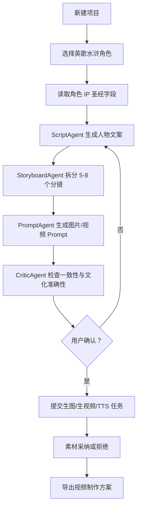
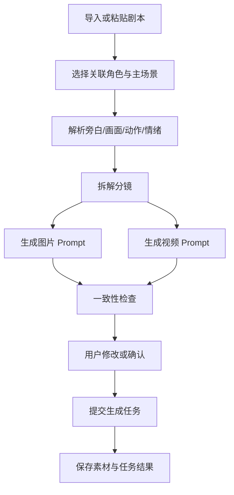
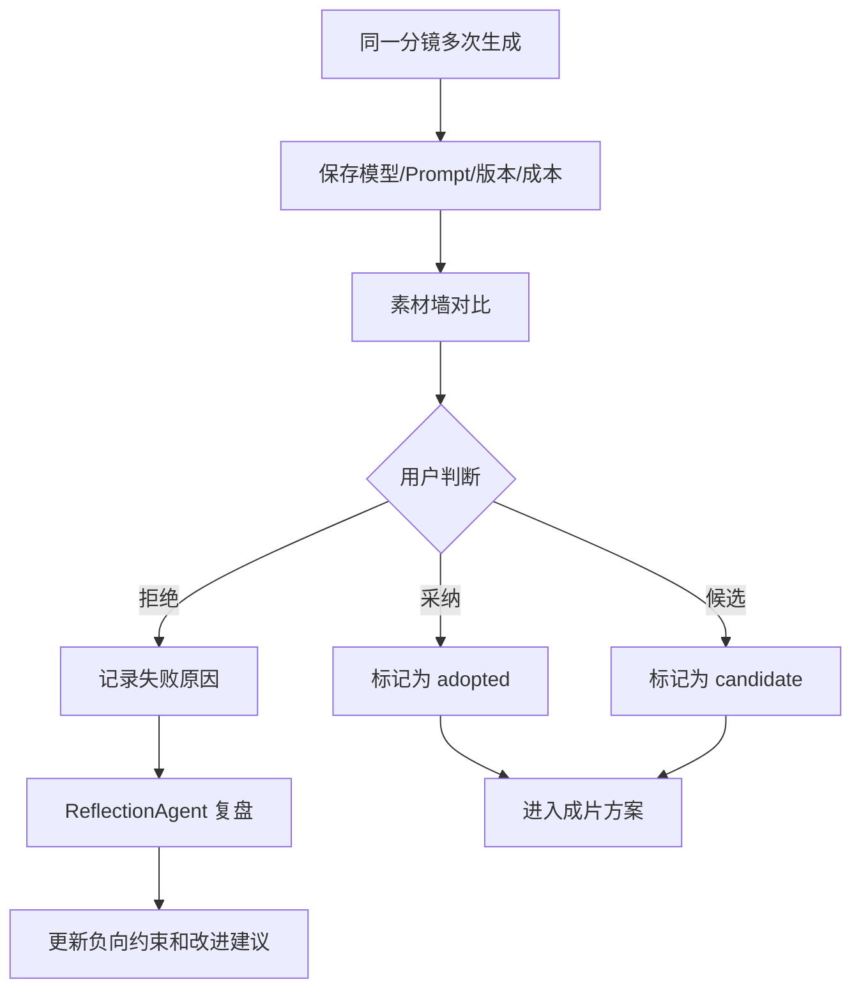

# AI 英歌漫剧内容生产工作台 PRD v1.0

## 1. 产品背景

AI 英歌漫剧内容生产工作台的起点不是做一个通用 AI 短剧 SaaS，而是解决一个非常具体的内容生产问题：如何用较低成本、较短周期，把“英歌非遗 + 水浒人物 + AI 漫剧”持续生产成可发布、可沉淀、可转化的短视频内容资产。

当前项目团队只有三个人：一人负责文创，用户本人负责技术，另一名成员职责暂不明确。用户目前基本依赖 AI 写代码，当前阶段全职投入，一个月后会因入职上海携程算法工程师转为兼职。因此第一版产品必须克制，优先服务内部团队自用，跑通从角色、脚本、分镜、Prompt、素材生成到采纳复盘的闭环。

项目 6 个月目标是通过英歌漫剧内容引流，为英歌非遗文创产品带来流量；如果漫剧内容本身爆发，也可以进一步成为收入来源。这个方向同时也是用户的副业收入方向。

第一份核心资料是：

- `/Users/huabi/code/AI-video-studio/data/英歌水浒角色基础信息.xlsx`
- 分析文档：`/Users/huabi/code/AI-video-studio/docs/07-excel-analysis/yingge-character-bible-analysis.md`

该 Excel 已经具备“角色 IP 圣经”雏形，包含身份层、内核层、文化视觉层、叙事素材层、商业文化层，可直接支撑角色库、角色一致性、图片 Prompt、视频 Prompt、文创转化等 MVP 能力。

## 2. 产品定位

一句话定义：

AI 英歌漫剧内容生产工作台，是一个面向英歌非遗 IP 沉淀与短视频引流的内部 AI 内容生产工具，帮助团队基于英歌水浒角色快速生成 30-60 秒人物介绍短视频的脚本、分镜、角色一致性设定、图片 Prompt、视频 Prompt、TTS 与素材管理记录。

它不是：

- 不是通用 AI 短剧平台。
- 不是给所有行业使用的 SaaS。
- 不是全自动无人值守的剧集生成系统。
- 不是第一版就要覆盖完整剪辑、发布、投流、订单转化的商业平台。

它是：

- 英歌非遗 IP 内容生产工作台。
- 英歌水浒人物短视频的生产中枢。
- 角色 IP 圣经、Prompt 工程、素材采纳记录、Agent 工作流的统一管理工具。
- 未来文创产品、跨境文化出海、ToB 定制服务的内容资产底座。

## 3. 目标用户

### 3.1 当前用户：项目团队自己

当前最重要用户是内部三人团队。

| 用户角色 | 需求 | 典型使用方式 |
|---|---|---|
| 用户本人，技术负责人 | 快速搭建内部工具，减少手工写 Prompt 和整理素材的时间 | 配置模型、导入角色、生成脚本/分镜/Prompt、管理任务和成本 |
| 文创负责人 | 从角色 IP 中提取商品卖点、视觉元素、祈福寓意 | 查看角色商业文化层、提取命名方向、商品纹样、目标人群 |
| 第三名成员 | 职责未确认 | 暂按内容运营或素材整理预留权限和流程 |

当前团队的核心目标不是“多人协作管理平台”，而是让少数人以更低摩擦生产可发布视频。

### 3.2 未来用户：非遗/文旅/短剧/文创团队

未来可能服务：

- 非遗团队：需要把传统文化内容转化为年轻人能看的视频内容。
- 文旅局、非遗中心：需要地方文化 IP 的宣传短视频。
- 短剧团队：需要 AI 辅助脚本、分镜、素材生成。
- 文创团队：需要从角色故事、视觉纹样、文化寓意中转化商品。
- 海外华人文化内容团队：需要中国非遗文化出海素材。

v1.0 PRD 只为未来扩展保留数据结构和流程，不在一个月 MVP 中做 ToB 多租户、复杂权限和商业交付系统。

## 4. 商业目标

商业目标优先级：D -> A -> E -> C。

| 优先级 | 目标 | 说明 |
|---|---|---|
| D | IP 沉淀 | 通过英歌漫剧积累英歌水浒人物、视觉、叙事、Prompt、素材、成片记录，形成可复用 IP 内容资产 |
| A | 自用短视频生产 | 用于生产抖音、视频号、海外平台短视频，前期以人物介绍内容养号 |
| E | 技术学习 | 沉淀 AI Agent 工程能力、Prompt 生产链路、素材管理和成本统计能力 |
| C | 未来 ToB 定制 | 未来可能承接文旅局、非遗中心、品牌方定制服务 |

具体商业方向：

- 内容引流：前期用英歌水浒人物故事短视频获取自然流量。
- 英歌 IP 沉淀：沉淀角色、场景、视觉风格、故事线、素材和 Prompt。
- 文创产品转化：将角色主色、脸谱纹样、武器、祈福寓意转化为英歌槌、摆件、挂件、服饰、包装等产品元素。
- 未来文化出海：面向海外华人和喜欢中国文化的用户，输出更易理解的英歌非遗内容。
- 未来 ToB 定制：当内部内容生产流程稳定后，再考虑面向地方文旅、非遗机构、品牌方提供定制内容生产。

## 5. MVP 范围

### 5.1 一个月内做什么

一个月 MVP 只聚焦：英歌水浒人物介绍短视频生产。

必须完成：

1. 导入并浏览英歌水浒角色 Excel。
2. 基于角色生成 30-60 秒人物介绍文案。
3. 将文案拆成 5-8 个分镜。
4. 为每个分镜生成图片 Prompt。
5. 为每个分镜生成视频 Prompt。
6. 半自动提交生图任务：`gpt-image-2`、`nano banana`。
7. 半自动提交生视频任务：`Seedance 2.0`。
8. 生成或保存 TTS 任务：`MiniMax TTS`。
9. 保存图片、视频、音频素材。
10. 标记素材采纳、拒绝，并记录失败原因。
11. 记录基本成本。
12. 导出一条视频制作方案，包括文案、分镜、Prompt、素材选择、失败记录。

### 5.2 一个月内不做什么

| 不做 | 原因 |
|---|---|
| 不做通用短剧平台 | 当前目标是英歌非遗 IP，不应分散到泛行业模板 |
| 不做复杂 ToB 多租户 | 团队先自用，三人协作不需要企业级权限 |
| 不做全自动 Agent 自主执行 | 成本有限，模型不稳定，英歌文化准确性需要人工确认 |
| 不做完整剪辑器 | 一个月内应先输出制作方案和素材，剪辑可用外部工具完成 |
| 不做发布平台对接 | 抖音、视频号、海外平台发布流程先人工处理 |
| 不做订单、电商、CRM | 文创转化第一阶段只沉淀字段和内容，不做交易闭环 |
| 不做大规模世界观系统 | 后期再扩展多人物互动剧情和世界观 |
| 不做复杂素材版权系统 | 先记录来源、模型、时间、用途，后续增强授权追踪 |

### 5.3 为什么必须克制

- 预算只有 4000 元，不能把大量预算消耗在模型试错和过度工程上。
- 用户一个月后转兼职，系统必须在一个月内形成可用闭环。
- 早期最大不确定性不是系统架构，而是内容方向能否跑通自然流量。
- AI 素材生成存在抽卡问题，产品应优先管理“生成、采纳、拒绝、复盘”，而不是追求一次生成完美成片。

## 6. 核心使用流程

### 流程 A：从角色生成一条 60 秒人物介绍视频

步骤：

1. 用户新建项目，选择“人物介绍短视频”类型。
2. 从英歌角色库选择一个角色，例如宋江、林冲、关胜。
3. 系统读取角色身份层、内核层、文化视觉层、叙事素材层、商业文化层。
4. `ScriptAgent` 生成 30-60 秒人物文案。
5. `StoryboardAgent` 拆成 5-8 个分镜。
6. `PromptAgent` 为每个分镜生成图片 Prompt 和视频 Prompt。
7. `CriticAgent` 检查角色一致性、场景一致性、英歌文化准确性。
8. 用户确认后提交生图、生视频、TTS 任务。
9. 用户从生成素材中采纳或拒绝，系统记录结果。
10. 导出视频制作方案。

### 流程 B：从剧本生成分镜和视频素材

步骤：

1. 用户粘贴或导入已有剧本文案。
2. 用户选择关联角色和主场景。
3. 系统解析剧本结构，识别旁白、画面、动作、情绪。
4. `StoryboardAgent` 拆解分镜。
5. `PromptAgent` 为每个镜头生成图片 Prompt、视频 Prompt。
6. `CriticAgent` 检查角色设定是否偏离角色库。
7. 用户修改分镜或 Prompt。
8. 用户提交生成任务并管理素材。

### 流程 C：抽卡、采纳、拒绝和复盘

步骤：

1. 用户对同一分镜发起多次生图或生视频任务。
2. 系统将结果按分镜、模型、Prompt、版本归档。
3. 用户标记素材为采纳、候选、拒绝。
4. 拒绝时填写或选择失败原因，如角色不像、脸谱错误、色彩不对、镜头不稳、动作不符合英歌、成本过高。
5. `ReflectionAgent` 总结失败原因，形成改进建议。
6. 下次生成时，系统将失败记录转化为负向约束或 Prompt 修改建议。

## 7. 页面设计

### 7.1 项目列表页

| 项目 | 内容 |
|---|---|
| 页面目标 | 管理所有短视频生产项目，快速进入某条内容的制作流程 |
| 核心模块 | 项目卡片、项目状态、角色、目标平台、最近更新时间、成本汇总 |
| 关键操作 | 新建项目、复制项目、进入项目、归档项目、导出制作方案 |
| 数据来源 | `Project`、`Script`、`GenerateTask`、`Asset`、`CostRecord` |
| 验收标准 | 可创建人物介绍项目；可看到项目当前阶段；可进入脚本、分镜、素材管理流程 |

### 7.2 英歌角色库

| 项目 | 内容 |
|---|---|
| 页面目标 | 浏览从 Excel 导入的英歌水浒角色，作为内容生产入口 |
| 核心模块 | 角色列表、搜索、排名筛选、星位、主色系、英歌角色定位、导入状态 |
| 关键操作 | 导入 Excel、查看导入预览、进入角色详情、选择角色创建项目 |
| 数据来源 | `Character`、`CharacterVisualProfile`、`CharacterNarrativeProfile`、`CharacterCommercialProfile`、`PromptKeywordSet` |
| 验收标准 | 能看到 45 条角色数据；能搜索姓名/绰号；能从角色创建项目 |

### 7.3 角色详情页

| 项目 | 内容 |
|---|---|
| 页面目标 | 展示单个角色的身份、内核、视觉、叙事、商业文化档案 |
| 核心模块 | 基本信息、角色一致性摘要、视觉档案、叙事原点、Prompt 关键词、文创转化信息 |
| 关键操作 | 编辑角色快照、复制 Prompt 关键词、生成项目角色快照、查看来源行号 |
| 数据来源 | `Character`、`ProjectCharacter`、`CharacterVisualProfile`、`CharacterNarrativeProfile`、`CharacterCommercialProfile`、`PromptKeywordSet` |
| 验收标准 | 单个角色能完整展示五层信息；能区分“明确记录”和“推导依据”；能生成角色一致性摘要 |

### 7.4 剧本/文案生成页

| 项目 | 内容 |
|---|---|
| 页面目标 | 基于角色生成或导入 30-60 秒短视频文案 |
| 核心模块 | 角色选择、目标平台、视频时长、文案风格、生成结果、人工编辑区 |
| 关键操作 | 生成文案、重新生成、保存版本、导入已有剧本、送入分镜 |
| 数据来源 | `Project`、`ProjectCharacter`、`CharacterNarrativeProfile`、`Script` |
| 验收标准 | 能基于角色生成 60 秒以内人物介绍文案；能保存至少一个文案版本 |

### 7.5 分镜 Prompt 工作台

| 项目 | 内容 |
|---|---|
| 页面目标 | 将剧本拆分成镜头，并生成图片 Prompt、视频 Prompt |
| 核心模块 | 分镜列表、镜头画面、旁白、角色一致性引用、图片 Prompt、视频 Prompt、负向词 |
| 关键操作 | 自动拆分镜、编辑分镜、生成 Prompt、检查一致性、提交生成任务 |
| 数据来源 | `Script`、`ScriptScene`、`Shot`、`PromptDraft`、`ProjectCharacter`、`ProjectScene` |
| 验收标准 | 一条脚本能拆成 5-8 个分镜；每个分镜都有图片 Prompt 和视频 Prompt；能提交任务 |

### 7.6 素材/成片管理页

| 项目 | 内容 |
|---|---|
| 页面目标 | 管理图片、视频、音频素材，记录采纳、拒绝和失败原因 |
| 核心模块 | 素材墙、分镜筛选、任务状态、模型来源、成本、采纳标记、失败原因 |
| 关键操作 | 上传素材、保存生成结果、标记采纳/拒绝、填写失败原因、导出制作方案 |
| 数据来源 | `GenerateTask`、`Asset`、`Shot`、`CostRecord`、`AgentMemory` |
| 验收标准 | 能保存每次生成结果；能按分镜查看素材；能标记采纳/拒绝；能导出方案 |

## 8. 核心功能需求

### 8.1 项目管理

| 项目 | 内容 |
|---|---|
| 用户故事 | 作为内容生产者，我希望每条短视频都是一个项目，方便跟踪脚本、分镜、素材、成本和成片方案 |
| 功能描述 | 创建、查看、编辑、归档项目；记录项目类型、目标平台、视频时长、关联角色、当前状态 |
| 输入 | 项目名称、项目类型、目标平台、关联角色、目标时长 |
| 输出 | 项目记录、项目状态、项目成本概览 |
| 规则 | MVP 默认项目类型为“英歌水浒人物介绍”；目标时长默认 30-60 秒 |
| 验收标准 | 能创建项目；能关联角色；能进入文案、分镜、素材页面 |

### 8.2 英歌角色库

| 项目 | 内容 |
|---|---|
| 用户故事 | 作为团队成员，我希望从角色库选择一个水浒角色，直接开始生产人物介绍短视频 |
| 功能描述 | 展示从 Excel 导入的角色列表，支持搜索、查看身份、英歌定位、主色系、关键词 |
| 输入 | Excel 导入数据、搜索条件 |
| 输出 | 角色列表、角色详情入口 |
| 规则 | 数据来源必须可追溯到 Excel 路径、工作表名、行号 |
| 验收标准 | 能展示 45 条角色；能按姓名/绰号搜索；能进入详情页 |

### 8.3 角色一致性档案

| 项目 | 内容 |
|---|---|
| 用户故事 | 作为 Prompt 生产者，我希望系统固定角色外观、人格、武器和禁忌，减少同一角色多次生成时变形 |
| 功能描述 | 汇总身份、视觉、叙事、正向词、禁止词，生成角色一致性摘要 |
| 输入 | `Character`、`CharacterVisualProfile`、`CharacterNarrativeProfile`、`PromptKeywordSet` |
| 输出 | `ProjectCharacter.character_consistency_summary` |
| 规则 | 明确记录和推导依据要分开；禁止词不可混入正向 Prompt |
| 验收标准 | 每个项目角色都有一段可复制到 Prompt 的一致性摘要 |

### 8.4 场景一致性档案

| 项目 | 内容 |
|---|---|
| 用户故事 | 作为视频生产者，我希望同一场景在不同镜头里保持时代、氛围、色彩和空间一致 |
| 功能描述 | 为项目中的核心场景建立场景档案，包括场景名称、时代、地点、氛围、主色、关键物件、禁止元素 |
| 输入 | 核心叙事原点、剧本、人工补充 |
| 输出 | `ProjectScene`、`SceneAsset` |
| 规则 | MVP 支持手动编辑场景，不做复杂世界地图 |
| 验收标准 | 每个项目至少可创建一个主场景，并被分镜 Prompt 引用 |

### 8.5 剧本生成/导入

| 项目 | 内容 |
|---|---|
| 用户故事 | 作为内容生产者，我希望选择角色后一键生成 30-60 秒人物介绍文案，也能导入自己写的文案 |
| 功能描述 | 基于角色叙事档案生成短视频文案；支持人工编辑和版本保存 |
| 输入 | 角色、目标平台、时长、风格、已有文案 |
| 输出 | `Script` |
| 规则 | 文案必须围绕单个水浒人物；不虚构未确认文化事实 |
| 验收标准 | 能生成可读的 60 秒以内中文文案；可保存和编辑 |

### 8.6 分镜拆解

| 项目 | 内容 |
|---|---|
| 用户故事 | 作为制作者，我希望系统把文案拆成清晰镜头，方便后续生成图片和视频 |
| 功能描述 | 将脚本拆为 5-8 个分镜，每个分镜包含画面、动作、旁白、时长、情绪、角色、场景 |
| 输入 | `Script`、角色档案、场景档案 |
| 输出 | `ScriptScene`、`Shot` |
| 规则 | 30-60 秒视频默认 5-8 个镜头；每个镜头应可独立生成图片和视频 |
| 验收标准 | 能自动生成分镜表；用户可编辑镜头顺序和内容 |

### 8.7 图片 Prompt 生成

| 项目 | 内容 |
|---|---|
| 用户故事 | 作为制作者，我希望每个分镜自动生成适合生图模型的 Prompt，减少手写提示词 |
| 功能描述 | 基于镜头画面、角色一致性、场景一致性、视觉风格生成图片 Prompt |
| 输入 | `Shot`、`ProjectCharacter`、`CharacterVisualProfile`、`PromptKeywordSet`、`ProjectScene` |
| 输出 | `PromptDraft`，类型为 `image` |
| 规则 | 必须包含角色主色、脸谱、纹样、武器、画风；必须包含禁止词 |
| 验收标准 | 每个镜头能生成一个中文图片 Prompt 和负向词 |

### 8.8 视频 Prompt 生成

| 项目 | 内容 |
|---|---|
| 用户故事 | 作为制作者，我希望系统把静态画面转成可供生视频模型理解的动作和镜头语言 |
| 功能描述 | 为每个分镜生成视频 Prompt，包含动作、镜头运动、情绪、时长、画面连续性 |
| 输入 | `Shot`、图片 Prompt、角色档案、场景档案 |
| 输出 | `PromptDraft`，类型为 `video` |
| 规则 | 视频 Prompt 要强调动作连续、角色一致、镜头不乱跳 |
| 验收标准 | 每个镜头能生成一个 Seedance 2.0 可用的视频 Prompt 草案 |

### 8.9 生图任务

| 项目 | 内容 |
|---|---|
| 用户故事 | 作为制作者，我希望从工作台直接提交生图任务，并保存结果和成本 |
| 功能描述 | 支持 `gpt-image-2`、`nano banana` 生图任务提交、状态查询、结果保存 |
| 输入 | 图片 Prompt、模型、尺寸、数量 |
| 输出 | `GenerateTask`、`Asset`、`CostRecord` |
| 规则 | MVP 允许半自动：若 API 未稳定，可先保存外部生成结果和任务信息 |
| 验收标准 | 能记录一次生图任务的 Prompt、模型、结果、成本和采纳状态 |

### 8.10 生视频任务

| 项目 | 内容 |
|---|---|
| 用户故事 | 作为制作者，我希望基于分镜图片和视频 Prompt 生成短视频片段 |
| 功能描述 | 支持 `Seedance 2.0` 任务记录、提交、状态查询和结果保存 |
| 输入 | 参考图、视频 Prompt、时长、模型参数 |
| 输出 | `GenerateTask`、视频 `Asset`、`CostRecord` |
| 规则 | 失败任务可重试；同一分镜允许多次抽卡 |
| 验收标准 | 能为分镜保存至少一个视频素材，并关联 Prompt 和成本 |

### 8.11 TTS 任务

| 项目 | 内容 |
|---|---|
| 用户故事 | 作为制作者，我希望用 MiniMax 生成旁白音频，匹配人物介绍视频 |
| 功能描述 | 基于脚本文案生成 TTS 任务，保存音频和参数 |
| 输入 | 旁白文本、音色、语速、情绪 |
| 输出 | 音频 `Asset`、`GenerateTask`、`CostRecord` |
| 规则 | MVP 先支持整条文案生成一个旁白音频，后续再支持逐分镜配音 |
| 验收标准 | 能提交或记录 MiniMax TTS 任务，保存音频文件或外部链接 |

### 8.12 素材采纳/拒绝/复盘

| 项目 | 内容 |
|---|---|
| 用户故事 | 作为制作者，我希望每次抽卡结果都能被记录，失败原因能反哺下次 Prompt |
| 功能描述 | 对素材标记采纳、候选、拒绝；拒绝时记录失败原因；生成复盘建议 |
| 输入 | 素材、用户选择、失败原因 |
| 输出 | 素材状态、失败记录、`AgentMemory` |
| 规则 | 拒绝原因必须可分类；采纳素材可进入导出方案 |
| 验收标准 | 能标记素材状态；拒绝素材时能记录原因；下次生成可看到复盘建议 |

### 8.13 成本记录

| 项目 | 内容 |
|---|---|
| 用户故事 | 作为预算有限的团队，我希望知道每条视频花了多少钱，避免 4000 元预算被快速消耗 |
| 功能描述 | 记录每次文本、生图、生视频、TTS 调用的模型、次数、单价、估算成本 |
| 输入 | 任务记录、模型配置、手动成本 |
| 输出 | `CostRecord`、项目成本汇总 |
| 规则 | 若 API 未返回精确成本，则允许手动填写或按配置估算 |
| 验收标准 | 项目页能看到总成本；任务页能看到单次成本 |

### 8.14 Excel 角色导入

| 项目 | 内容 |
|---|---|
| 用户故事 | 作为团队成员，我希望把角色 IP 圣经 Excel 导入系统，并保持字段结构可追溯 |
| 功能描述 | 识别多级表头、合并单元格、复合基本信息字段，生成角色、视觉、叙事、商业、Prompt 关键词数据 |
| 输入 | `/Users/huabi/code/AI-video-studio/data/英歌水浒角色基础信息.xlsx` |
| 输出 | `Character`、`CharacterVisualProfile`、`CharacterNarrativeProfile`、`CharacterCommercialProfile`、`PromptKeywordSet` |
| 规则 | 不覆盖人工修改；保留来源路径、工作表名、行号；区分明确记录和推导依据 |
| 验收标准 | 能识别工作表 `角色IP圣经`；能导入 45 条角色；能解析姓名、绰号、排名、星位、出身 |

## 9. Agent 设计

第一版采用轻量 Agent：Agent 负责生成、检查、总结，不做复杂全自动自主决策。所有高成本任务和最终采纳必须由用户确认。

### 9.1 DirectorAgent

| 项目 | 内容 |
|---|---|
| 职责 | 理解用户目标，规划当前项目流程，决定下一步调用 Script、Storyboard、Prompt、Critic 或 Reflection |
| 输入 | 项目目标、角色、当前阶段、用户指令 |
| 输出 | 流程计划、下一步建议、待确认事项 |
| 读取角色字段 | 姓名、绰号、英歌角色定位、核心叙事原点、目标用户画像 |
| 读取场景字段 | 项目主场景、场景风格、已有关联分镜 |
| 写入记录 | `AgentMemory`、项目阶段状态 |

### 9.2 ScriptAgent

| 项目 | 内容 |
|---|---|
| 职责 | 生成人物介绍文案或根据用户输入改写剧本 |
| 输入 | 角色身份层、内核层、叙事素材层、目标平台、目标时长 |
| 输出 | `Script` 文案版本 |
| 读取角色字段 | 姓名、绰号、排名、星位、出身、梁山职务、核心人格标签、内在矛盾、人生经历、观众情绪触发点、核心叙事原点、角色关系图谱 |
| 读取场景字段 | 主场景名称、氛围、时代感 |
| 写入记录 | `Script`、`AgentMemory` |

### 9.3 StoryboardAgent

| 项目 | 内容 |
|---|---|
| 职责 | 将脚本拆分为镜头，生成分镜结构 |
| 输入 | `Script`、角色一致性摘要、场景档案 |
| 输出 | `ScriptScene`、`Shot` |
| 读取角色字段 | 英歌角色定位、核心叙事原点、人生关键经历节点、视觉调性关键词 |
| 读取场景字段 | 场景名称、地点、主色、关键物件、禁止元素 |
| 写入记录 | `Shot`、分镜版本 |

### 9.4 PromptAgent

| 项目 | 内容 |
|---|---|
| 职责 | 生成图片 Prompt 和视频 Prompt |
| 输入 | `Shot`、角色视觉档案、Prompt 关键词、场景档案、目标模型 |
| 输出 | `PromptDraft` |
| 读取角色字段 | 惯用武器、英歌脸谱主色、颜色象征含义、脸谱特征纹样、水浒原著色彩线索、视觉设计调性关键词、正向词、禁止词 |
| 读取场景字段 | 场景主色、空间、光线、天气、时代元素、禁止元素 |
| 写入记录 | `PromptDraft`、Prompt 版本 |

### 9.5 CriticAgent

| 项目 | 内容 |
|---|---|
| 职责 | 检查人物一致性、场景一致性、英歌文化准确性，指出风险 |
| 输入 | 脚本、分镜、Prompt、角色档案、场景档案 |
| 输出 | 检查意见、风险等级、修改建议 |
| 读取角色字段 | 全部身份层、文化视觉层、正向词、禁止词、证据类型 |
| 读取场景字段 | 场景一致性档案、禁止元素 |
| 写入记录 | `AgentMemory`、检查记录 |

### 9.6 ReflectionAgent

| 项目 | 内容 |
|---|---|
| 职责 | 在用户拒绝素材后总结失败原因，并反哺下一轮 Prompt |
| 输入 | 被拒绝素材、原 Prompt、模型、失败原因、用户备注 |
| 输出 | 失败总结、Prompt 改进建议、负向词建议 |
| 读取角色字段 | 角色一致性摘要、禁止词、视觉档案 |
| 读取场景字段 | 场景档案、分镜目标 |
| 写入记录 | `AgentMemory`、素材失败记录、Prompt 修改建议 |

## 10. 数据模型初稿

当前阶段为 PRD 和架构设计，数据库表名、ORM、函数名均未确认。以下实体是 MVP 数据模型草案。

### User

- 说明：系统使用者，MVP 主要为内部团队。
- 关键字段：`id`、`name`、`email`、`role`、`created_at`。
- 关系：一个 `User` 可创建多个 `Project`，可操作多个 `Asset` 和 `GenerateTask`。

### Project

- 说明：一条短视频生产项目。
- 关键字段：`id`、`user_id`、`title`、`type`、`target_platform`、`target_duration_sec`、`status`、`total_cost_estimate`、`created_at`、`updated_at`。
- 关系：一个 `Project` 有多个 `ProjectCharacter`、`Script`、`ProjectScene`、`GenerateTask`、`Asset`、`CostRecord`。

### Character

- 说明：通用角色母表，沉淀水浒角色身份。
- 关键字段：`id`、`name`、`nickname`、`ranking`、`star_position`、`origin`、`liangshan_role`、`primary_weapon`、`weapon_note`、`source_work`。
- 关系：一个 `Character` 有一个或多个视觉、叙事、商业档案，可被多个 `ProjectCharacter` 引用。

### ProjectCharacter

- 说明：项目内角色快照，锁定某条视频使用的角色版本。
- 关键字段：`id`、`project_id`、`character_id`、`snapshot_name`、`snapshot_nickname`、`yingge_role_position`、`character_consistency_summary`、`version`。
- 关系：属于一个 `Project` 和一个 `Character`，被 `Shot`、`PromptDraft` 引用。

### CharacterVisualProfile

- 说明：角色视觉档案。
- 关键字段：`id`、`character_id`、`yingge_role_position`、`evidence_type`、`face_primary_color`、`face_secondary_colors`、`color_symbolism`、`face_patterns`、`source_color_clues`、`visual_tone_keywords`。
- 关系：属于一个 `Character`，为 `PromptAgent` 和 `CriticAgent` 提供依据。

### CharacterNarrativeProfile

- 说明：角色叙事档案。
- 关键字段：`id`、`character_id`、`personality_tags`、`inner_conflict`、`life_event_nodes`、`audience_emotion_trigger`、`target_audience_profile`、`core_scene_title`、`core_scene_source`、`core_scene_text`、`relationship_graph`。
- 关系：属于一个 `Character`，被 `ScriptAgent` 和 `StoryboardAgent` 读取。

### CharacterCommercialProfile

- 说明：角色文创转化档案。
- 关键字段：`id`、`character_id`、`target_user_profile`、`commercial_positioning`、`symbolic_meaning`、`naming_directions`、`product_tone_tags`、`blessing_meaning`、`merchandising_elements`。
- 关系：属于一个 `Character`，未来服务文创页面和商品内容生成。

### SceneAsset

- 说明：场景参考素材，如背景图、场景设定图、参考视频。
- 关键字段：`id`、`project_scene_id`、`asset_id`、`usage_type`、`note`。
- 关系：连接 `ProjectScene` 和 `Asset`。

### ProjectScene

- 说明：项目内场景一致性档案。
- 关键字段：`id`、`project_id`、`name`、`location`、`time_period`、`mood`、`primary_colors`、`key_objects`、`negative_elements`、`consistency_summary`。
- 关系：属于一个 `Project`，被多个 `Shot` 引用，可关联多个 `SceneAsset`。

### Script

- 说明：项目剧本或人物介绍文案。
- 关键字段：`id`、`project_id`、`title`、`content`、`duration_sec`、`version`、`status`、`created_by_agent`。
- 关系：属于一个 `Project`，包含多个 `ScriptScene`。

### ScriptScene

- 说明：剧本段落或场次。
- 关键字段：`id`、`script_id`、`order_index`、`summary`、`narration`、`emotion`。
- 关系：属于一个 `Script`，包含多个 `Shot`。

### Shot

- 说明：具体分镜。
- 关键字段：`id`、`script_scene_id`、`project_character_id`、`project_scene_id`、`order_index`、`duration_sec`、`visual_description`、`action_description`、`narration`、`emotion`。
- 关系：属于一个 `ScriptScene`，可关联角色、场景、Prompt、生成任务和素材。

### PromptDraft

- 说明：图片或视频 Prompt 草案。
- 关键字段：`id`、`shot_id`、`type`、`model_target`、`positive_prompt`、`negative_prompt`、`version`、`status`。
- 关系：属于一个 `Shot`，可触发多个 `GenerateTask`。

### GenerateTask

- 说明：AI 生成任务，包括文本、生图、生视频、TTS。
- 关键字段：`id`、`project_id`、`shot_id`、`prompt_draft_id`、`task_type`、`provider`、`model`、`status`、`request_payload`、`response_payload`、`error_message`、`retry_count`。
- 关系：属于一个 `Project`，可生成多个 `Asset`，对应 `CostRecord`。

### Asset

- 说明：素材文件或外部素材链接。
- 关键字段：`id`、`project_id`、`shot_id`、`generate_task_id`、`asset_type`、`file_path`、`external_url`、`status`、`failure_reason`、`note`。
- 关系：属于一个 `Project`，可来源于一个 `GenerateTask`，可被采纳进入导出方案。

### AgentMemory

- 说明：Agent 工作记忆和复盘记录。
- 关键字段：`id`、`project_id`、`agent_name`、`memory_type`、`content`、`related_entity_type`、`related_entity_id`、`created_at`。
- 关系：属于一个 `Project`，可关联素材、Prompt、脚本或分镜。

### AgentSkill

- 说明：Agent 可调用的能力或提示词模板配置。
- 关键字段：`id`、`agent_name`、`skill_name`、`description`、`prompt_template`、`input_schema`、`output_schema`、`enabled`。
- 关系：被 Agent 运行时读取，不直接属于项目。

### CostRecord

- 说明：模型调用成本记录。
- 关键字段：`id`、`project_id`、`generate_task_id`、`provider`、`model`、`task_type`、`unit_cost`、`quantity`、`estimated_cost`、`actual_cost`、`currency`。
- 关系：属于一个 `Project`，通常关联一个 `GenerateTask`。

## 11. 英歌类目模板

英歌类目模板是把领域知识固化成可复用结构，避免每条视频都从零写 Prompt。

| 模板 | 内容 |
|---|---|
| 英歌知识库 | 英歌舞基本介绍、角色类型、队形、司鼓者、槌手、旗手、头槌、常见动作、文化禁忌 |
| 角色字段模板 | 身份层、内核层、文化视觉层、叙事素材层、商业文化层 |
| 场景字段模板 | 场景名称、地点、时代、主色、天气、光线、氛围、关键物件、禁止元素 |
| 视觉风格模板 | 国风水墨、游戏 CG、黑神话悟空质感、剑来漫剧氛围、英歌脸谱、潮汕文化元素 |
| Prompt 模板 | 人物设定 Prompt、单镜头图片 Prompt、视频动作 Prompt、TTS 旁白风格 Prompt |
| 禁止词模板 | 角色禁止词、画风禁止词、文化错误禁止词、视频运动错误禁止词 |
| 失败案例库 | 角色不像、脸谱错误、主色跑偏、武器错误、动作不英歌、镜头混乱、画面廉价、TTS 情绪不对 |

MVP 中模板先以配置和文本形式存在，不做复杂模板市场。

## 12. 非功能需求

### 性能

- 角色库列表加载应在 2 秒内完成。
- 单次文案、分镜、Prompt 生成允许等待，但需显示任务状态。
- 素材列表应支持按项目、分镜、状态筛选，避免大量素材堆在一起。

### 安全

- 不读取 `.env`、key、token、证书文件。
- API Key 不进入前端代码，不写入日志，不出现在导出方案中。
- 生成任务的请求和响应可保存，但敏感认证信息必须剔除。

### 成本控制

- 所有模型任务必须记录模型、次数、估算成本。
- 高成本任务如生视频必须由用户确认后触发。
- 支持项目成本汇总，避免 4000 元预算不可见地消耗。

### 可维护性

- Agent 提示词、模型配置、英歌模板应配置化。
- Excel 导入要保留来源路径、工作表名、行号，方便追溯。
- 不把角色长文本散落在 Prompt 中，应通过结构化实体读取。

### 可扩展性

- 数据模型保留多项目、多角色、多场景、多模型能力。
- 未来可扩展多人物互动剧情、世界观、商品转化页面、ToB 定制项目。
- Agent 先轻量实现，但保留 `AgentSkill`、`AgentMemory` 扩展点。

### 版权/授权追踪

- 每个素材记录生成模型、生成时间、Prompt、来源任务。
- 外部上传素材应记录来源说明和使用限制。
- 对水浒原著、英歌非遗资料、参考风格、AI 生成素材的授权边界需要后续补充，当前状态为未确认。

## 13. API 接入范围

第一版接入范围：

| 类型 | 模型/服务 | MVP 要求 |
|---|---|---|
| 文本模型 | 多模型配置 | 用于脚本、分镜、Prompt、检查和复盘 |
| 生图 | `gpt-image-2` | 提交图片生成任务或记录外部生成结果 |
| 生图 | `nano banana` | 提交图片生成任务或记录外部生成结果 |
| 生视频 | `Seedance 2.0` | 基于图片和视频 Prompt 生成镜头片段 |
| TTS | `MiniMax TTS` | 生成旁白音频 |

### API Key 管理

- API Key 只允许通过服务端环境变量或安全配置读取。
- 不在 PRD、日志、数据库明文、前端页面、导出文件中展示 Key。
- 当前仓库不得读取任何 `.env`、key、token、证书文件。

### 任务失败重试

- `GenerateTask` 记录 `status`、`error_message`、`retry_count`。
- 文本任务失败可自动重试 1 次。
- 生图、生视频、TTS 任务失败默认手动重试，避免成本失控。
- 重试必须保留原 Prompt 和新 Prompt 版本。

### 成本记录

- 每次模型调用生成一条 `CostRecord`。
- 若 API 返回 token、图片张数、视频秒数、音频字符数，则按实际记录。
- 若 API 未返回成本，则按模型配置估算，标记为 `estimated`。

## 14. MVP 验收标准

一个月后，MVP 应至少能完成以下验收：

| 验收项 | 标准 |
|---|---|
| Excel 角色导入 | 能导入 `/Users/huabi/code/AI-video-studio/data/英歌水浒角色基础信息.xlsx`，识别工作表 `角色IP圣经`，导入 45 条角色 |
| 角色浏览 | 能查看角色身份层、内核层、文化视觉层、叙事素材层、商业文化层 |
| 60 秒文案生成 | 选择一个角色后，能生成 30-60 秒人物介绍文案 |
| 分镜生成 | 能把文案拆成 5-8 个分镜 |
| 图片 Prompt | 每个分镜能生成图片 Prompt 和禁止词 |
| 视频 Prompt | 每个分镜能生成视频 Prompt |
| 生图任务 | 能提交或记录 `gpt-image-2`、`nano banana` 生图任务 |
| 生视频任务 | 能提交或记录 `Seedance 2.0` 生视频任务 |
| TTS 任务 | 能提交或记录 `MiniMax TTS` 任务 |
| 素材保存 | 能上传或保存图片、视频、音频素材 |
| 采纳/拒绝 | 能对素材标记采纳、候选、拒绝 |
| 失败原因 | 拒绝素材时能记录失败原因 |
| 成本记录 | 能看到项目级成本汇总 |
| 导出方案 | 能导出一条视频制作方案，包含文案、分镜、Prompt、素材选择、失败记录 |

## 15. 版本规划

### v0.1：一个月 MVP

目标：跑通内部自用生产闭环。

- Excel 角色导入。
- 角色库和角色详情。
- 单人物 30-60 秒文案生成。
- 5-8 个分镜拆解。
- 图片 Prompt、视频 Prompt 生成。
- 生图、生视频、TTS 任务记录。
- 素材采纳、拒绝、失败复盘。
- 基础成本统计。
- 导出视频制作方案。

### v0.2：批量生产和成本统计增强

目标：提升短视频养号效率。

- 批量选择角色生成选题。
- 批量生成脚本和分镜草案。
- 更细的模型成本统计。
- 素材对比和复用。
- Prompt 版本对比。
- 失败原因统计报表。

### v0.3：多人物剧情和世界观

目标：从人物介绍扩展到多人物互动剧情。

- 多角色同场景一致性。
- 角色关系图谱驱动剧情。
- 英歌世界观设定。
- 连续剧集项目。
- 社会现实和人生哲理主题模板。
- 场景库和世界观资产库。

### v1.0：完整英歌 IP 内容生产系统

目标：形成英歌 IP 内容资产系统，支撑文创转化和未来 ToB 定制。

- 完整角色 IP 圣经管理。
- 英歌知识库和文化审核能力。
- 成片生产流程增强。
- 文创商品转化字段和内容生成。
- 海外平台多语言内容支持。
- ToB 项目模板和交付包。
- 更完善的版权、授权、素材来源追踪。

